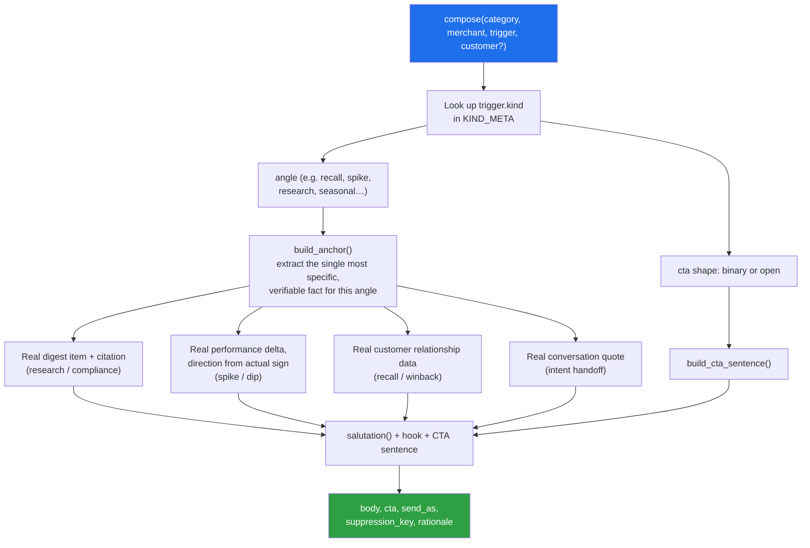

# Vera — magicpin AI Challenge Submission

A deterministic, rule-based message-composition engine for Vera, magicpin's
merchant-growth assistant. Given a merchant's live context, it decides the
single best next message, its CTA shape, who it's sent as, and why —
without ever inventing a fact it wasn't given.

**Live bot:** https://vera-bot-585x.onrender.com
**Health check:** https://vera-bot-585x.onrender.com/v1/healthz

> ⚠️ **Free-tier hosting note.** The live bot is hosted on Render's Free
> web-service tier. Free services can spin down after 15 minutes without
> inbound traffic and may take about a minute to wake up. This bot stores
> `/v1/context` data in memory, so a restart/spin-down clears the loaded
> context. Before an evaluation window, re-run:
>
> ```bash
> python scripts/push_context.py --bot-url https://vera-bot-585x.onrender.com --data expanded
> ```

---

## Contents

- [What this is](#what-this-is)
- [How a message gets composed](#how-a-message-gets-composed)
- [Trigger kind → angle → CTA mapping](#trigger-kind--angle--cta-mapping)
- [Conversation handling](#conversation-handling)
- [API surface](#api-surface)
- [Why rule-based instead of an LLM call](#why-rule-based-instead-of-an-llm-call)
- [Repo layout](#repo-layout)
- [Quickstart](#quickstart)
- [Testing](#testing)
- [Regenerating the deliverable](#regenerating-the-deliverable)
- [Deployment](#deployment)
- [What additional context would have helped most](#what-additional-context-would-have-helped-most)
- [Audit changelog](#audit-changelog)
- [Team](#team)

---

## What this is

`compose(category, merchant, trigger, customer?)` → `{body, cta, send_as,
suppression_key, rationale}`, served over the 5 endpoints the challenge
harness expects (`/v1/context`, `/v1/tick`, `/v1/reply`, `/v1/healthz`,
`/v1/metadata`), plus the optional `bot.py` / `conversation_handlers.py`
entry points named in the brief's own skeleton.

| Property              | This submission                                         |
| --------------------- | ------------------------------------------------------- |
| Composition           | Rule-based, deterministic — no LLM call in the hot path |
| Determinism           | Guaranteed (`tests/test_compose.py::test_determinism`)  |
| Latency               | Sub-100ms typical, nowhere near the 30s budget          |
| External dependencies | None required to run                                    |
| Fact sourcing         | Only from the 4 input contexts — never fabricated       |

---

## How a message gets composed



Every anchor function reads directly from `category` / `merchant` /
`trigger` / `customer` — if the specific field isn't present, the composer
falls back to the next most specific thing it _does_ have (e.g. category
peer stats), rather than inventing a number.

---

## Trigger kind → angle → CTA mapping

The judge's harness delivers 27 distinct `trigger.kind` values. Each maps
to one of ~15 framing angles and a CTA shape (`binary` = YES/STOP or a
numbered choice; `open` = an open-ended, low-friction ask):

| Trigger kind               | Angle                        | CTA    |
| -------------------------- | ---------------------------- | ------ |
| `research_digest`          | research                     | open   |
| `cde_opportunity`          | research                     | open   |
| `regulation_change`        | compliance                   | open   |
| `supply_alert`             | compliance                   | binary |
| `recall_due`               | recall                       | binary |
| `customer_lapsed_soft`     | recall                       | binary |
| `chronic_refill_due`       | recall                       | binary |
| `trial_followup`           | recall                       | binary |
| `customer_lapsed_hard`     | winback                      | binary |
| `winback_eligible`         | winback                      | binary |
| `perf_spike`               | spike                        | open   |
| `perf_dip`                 | dip                          | open   |
| `seasonal_perf_dip`        | dip                          | open   |
| `milestone_reached`        | milestone                    | open   |
| `dormant_with_vera`        | dormant                      | open   |
| `appointment_tomorrow`     | appointment                  | binary |
| `review_theme_emerged`     | review                       | open   |
| `scheduled_recurring`      | curious_ask                  | open   |
| `curious_ask_due`          | curious_ask                  | open   |
| `festival_upcoming`        | seasonal                     | binary |
| `category_seasonal`        | seasonal                     | binary |
| `ipl_match_today`          | seasonal                     | binary |
| `wedding_package_followup` | seasonal                     | binary |
| `active_planning_intent`   | intent                       | binary |
| `renewal_due`              | renewal                      | binary |
| `gbp_unverified`           | gbp                          | binary |
| `competitor_opened`        | competitor                   | open   |
| _(anything unmapped)_      | generic (peer-stat fallback) | open   |

Direction words for `perf_spike` / `perf_dip` ("up"/"down") are derived
from the **actual sign** of the real performance delta, never from the
trigger's kind label — a generated `perf_dip` trigger whose merchant
currently has a positive delta will correctly say "up," not contradict the
real numbers to match its own label.

---

## Conversation handling

`handle_reply()` (used by `POST /v1/reply`) implements the three
behaviours the brief flags as production Vera's biggest gaps:

| Signal in merchant's message                                 | Bot behaviour                                   | Why                                                                 |
| ------------------------------------------------------------ | ----------------------------------------------- | ------------------------------------------------------------------- |
| Canned/auto-reply text, first time                           | One direct, low-effort nudge                    | Brief §9 Pattern B — try once before assuming no human is behind it |
| Same canned text again                                       | `action: end`                                   | Stop burning turns on a bot-to-bot loop                             |
| Explicit agreement ("let's do it", "go ahead", "haan chalo") | Routes straight to action, no further questions | Avoids the re-qualifying failure mode in Pattern D                  |
| Explicit opt-out ("not interested", "stop")                  | `action: end`                                   | Respect the ask immediately                                         |
| "call me later" / busy                                       | `action: wait` (1800s)                          | Back off instead of pushing                                         |
| Anything else                                                | `action: send`, one low-friction next step      | Keep the conversation moving without overwhelming                   |

Anti-repetition and dedup are enforced structurally, not just by prompt
instruction:

- `/v1/tick` tracks `suppression_key`s already sent **per merchant** and
  skips repeats on subsequent ticks.
- `/v1/reply` tracks bodies already sent **per conversation** and
  rephrases rather than resending verbatim.
- `/v1/context` treats a re-post of an **unchanged version** as an
  idempotent no-op (`accepted: true`) rather than rejecting it — this
  matters because a judge harness that re-syncs context mid-run shouldn't
  have those pushes silently fail.

---

## API surface

| Method & path      | Purpose                                                                                                            |
| ------------------ | ------------------------------------------------------------------------------------------------------------------ |
| `GET /v1/healthz`  | Liveness + count of loaded contexts by scope                                                                       |
| `GET /v1/metadata` | Team info, model/approach description, version                                                                     |
| `POST /v1/context` | Push a `category` / `merchant` / `customer` / `trigger` context (idempotent by `scope` + `context_id` + `version`) |
| `POST /v1/tick`    | Given `available_triggers`, return up to 20 composed `actions`                                                     |
| `POST /v1/reply`   | Given a merchant's message, return `send` / `wait` / `end`                                                         |

---

## Why rule-based instead of an LLM call

- **Determinism is free** — no temperature=0 caveat, no seed-drift risk.
- **Zero external dependencies / API cost** — works out of the box with
  nothing but `pip install -r requirements.txt`.
- **Latency is a non-issue** — every response is nowhere near the 30s
  budget, so there's no risk of the "return `{actions: []}` because we ran
  out of time" failure mode an LLM-in-the-loop composer risks under the
  harness's 30s timeout / 10 req/s cap.
- **Trade-off**: a ceiling on linguistic creativity/naturalness compared to
  an LLM composer. The natural next step, given more time, is an optional
  LLM "polish" pass (temperature=0, strict system prompt forbidding new
  facts) layered on top of the same anchor-extraction logic — the anchor
  extraction is the part that needs to stay grounded and hand-verified, so
  keeping _that_ rule-based and only asking an LLM to rephrase (never to
  source facts) would preserve the no-hallucination guarantee while
  improving fluency.

---

## Repo layout

```
app/
  compose.py              — pure composer + reply-handler (no I/O, fully unit-testable)
  bot.py                  — FastAPI server exposing the 5 required endpoints
bot.py                    — root-level shim (`uvicorn bot:app`, matches the brief's literal skeleton)
conversation_handlers.py  — optional §7.4 deliverable: respond(state, merchant_message)
scripts/
  push_context.py         — pushes expanded/ dataset into a running bot via /v1/context
  generate_submission.py  — produces submission.jsonl from the 30 canonical test pairs
  local_selftest.py       — 46-point structural contract check, no server or API key needed
tests/
  test_compose.py         — smoke tests: determinism, required keys, reply routing
dataset/                  — seed data + generator (unchanged from the challenge pack)
expanded/                 — generated dataset (committed — see note below)
submission.jsonl          — the 30 required outputs
judge_simulator.py        — local LLM-judge dry-run tool (from the challenge pack; not part of the bot itself)
```

> `expanded/` is reproducible from `dataset/generate_dataset.py` + the seed
> files, but it's committed as-is rather than `.gitignore`'d — a clone
> should work with zero setup steps rather than depending on the generator
> producing byte-identical output in someone else's environment. Regenerate
> it locally any time with:
>
> ```bash
> python dataset/generate_dataset.py --seed-dir dataset --out expanded
> ```

---

## Quickstart

```bash
python -m venv venv
venv\Scripts\activate        # Windows PowerShell
# source venv/bin/activate   # macOS/Linux

pip install -r requirements.txt
uvicorn app.bot:app --host 0.0.0.0 --port 8080
```

In a second terminal:

```bash
python scripts/push_context.py --bot-url http://localhost:8080 --data expanded
curl http://localhost:8080/v1/healthz
```

---

## Testing

```bash
# No server, no API key — validates the full HTTP contract in-process:
python scripts/local_selftest.py --data expanded

# Unit tests: determinism, required keys, reply routing
pip install pytest
python -m pytest tests/ -v
```

| Check                                                            | Tool                                           | Needs a server?              | Needs an API key?               |
| ---------------------------------------------------------------- | ---------------------------------------------- | ---------------------------- | ------------------------------- |
| Determinism, required keys, reply routing                        | `tests/test_compose.py`                        | No                           | No                              |
| Full HTTP contract (idempotency, dedup, timing, endpoint shapes) | `scripts/local_selftest.py`                    | No (in-process)              | No                              |
| Prose-quality scoring against the 5-dimension rubric             | `judge_simulator.py` (from the challenge pack) | Yes (a running/deployed bot) | Yes (your own LLM provider key) |

---

## Regenerating the deliverable

```bash
python scripts/generate_submission.py --data expanded --out submission.jsonl
```

---

## Deployment

Hosted on [Render](https://render.com) (free tier):

| Setting        | Value                                             |
| -------------- | ------------------------------------------------- |
| Build command  | `pip install -r requirements.txt`                 |
| Start command  | `uvicorn app.bot:app --host 0.0.0.0 --port $PORT` |
| Python version | Pinned to `3.11` via `.python-version`            |

Render's current default Python (3.14) has no prebuilt wheel for this
project's pinned `pydantic-core` version, which fails to build from source
in Render's build sandbox. Pinning to 3.11 uses a prebuilt wheel and avoids
the issue entirely.

---

## What additional context would have helped most

- A structured `next_best_action` hint per trigger (even just a category
  tag) would remove the need to infer a framing angle from `kind` string
  matching.
- Some generator-expanded triggers carry `payload: {"placeholder": true}`
  rather than real fields — real payloads (like the seed set) make a much
  bigger quality difference than any prompting change would, since the
  composer intentionally refuses to fabricate specifics it wasn't given.

---

## Audit changelog

This post-submission hardening pass focused on concrete gaps found by re-reading
the challenge briefs, checking the dataset payloads, and exercising the
conversation edge cases.

### 11 concrete improvements

1. **Trigger ranking**
   `/v1/tick` now ranks eligible trigger candidates instead of processing
   `available_triggers` in input order. Candidates are scored on urgency,
   payload groundedness, merchant-signal strength, customer relevance,
   actionability, and category fit.

2. **Trigger expiry**
   Expired triggers are rejected using `trigger.expires_at` against the
   tick's `now`, so stale opportunities are not messaged.

3. **Consent enforcement**
   Customer-facing triggers are checked against the customer's recorded
   consent scope before `/v1/tick` can send an action.

4. **Payload-first specificity**
   Trigger payload fields are used as the primary source of specificity for
   competitor, IPL, supply, milestone, wedding-follow-up, and performance
   triggers. Placeholder payloads fall back only to verified merchant data.

5. **Performance contradiction guard**
   `perf_spike` / `perf_dip` directions are checked against the actual measured
   `delta_pct`. Contradictory triggers are suppressed rather than generating
   a message that conflicts with the merchant's own numbers.

6. **Conversation state**
   `/v1/reply` now remembers the original trigger, merchant/customer context,
   outbound message, available offer, category, auto-reply count, intent state,
   and opt-out state. Follow-ups therefore stay anchored to the actual
   conversation instead of falling back to generic acknowledgements.

7. **Improved auto-reply detection**
   Auto-reply detection is not exact-string-only. It combines fixed canned
   phrases, generic canned-language markers, and token similarity against
   previously seen canned replies. A second differently-worded autoresponder
   is therefore still recognized as a repeat.

8. **Immediate intent transition**
   Explicit replies such as `yes`, `go ahead`, `let's do it`, `haan`, and
   `haan chalo` move directly into action mode without asking another
   qualifying question.

9. **Anti-repetition / CTA protection**
   `/v1/reply` avoids sending the same body again and prevents a fallback
   rephrase from accidentally stacking a second CTA onto a message that
   already contains one.

10. **Strict `/v1/context` contract**
    The context endpoint now follows the challenge contract for same-version,
    stale-version, invalid-scope, missing-field, and malformed-payload cases,
    returning the specified `400`/`409` responses rather than FastAPI's default
    validation response.

11. **Grounded competitor fallback**
    `competitor_opened` no longer falls back to a fact-free generic sentence
    when its generated payload is only a placeholder. It uses verified
    merchant performance/category-peer data or a live merchant offer when
    available.

### Conversation hardening

The conversation layer is designed around three practical failure modes:

- **Repeated autoresponders:** one initial nudge is allowed; repeated canned
  replies cause a graceful exit instead of wasting additional turns.
- **Explicit intent:** an affirmative response immediately enters action mode
  rather than asking another qualification question.
- **Safe repetition handling:** previously sent bodies are tracked so replies
  do not resend the same message or introduce multiple competing CTAs.

The implementation remains deterministic: `compose()`, `/v1/tick`, and
`/v1/reply` use only the supplied context and local Python logic. No LLM call is
required in the bot hot path.

### Test coverage

`tests/test_fixes.py` adds 51 regression and hardening tests, including
auto-reply detection, intent handling, anti-repetition, and the
`/v1/context` contract.

Across the repository, **57 tests pass**, with deterministic required-key
coverage across all **27 trigger kinds** represented in the dataset.

```bash
python -m pytest tests/ -v

```

## Team

|               |                                   |
| ------------- | --------------------------------- |
| **Team name** | Vishuddhi Jain                    |
| **Members**   | Vishuddhi Jain                    |
| **Contact**   | https://github.com/Vishuddhijain/ |
